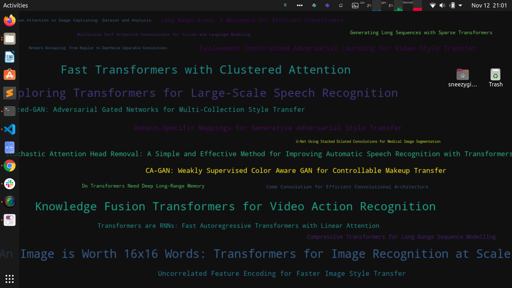

# OH-MY-DL

With the recent paced deep learning research, it is very difficult to keep oneself upto date with their topics of interest. This utility aims to bridge this gap to ensure easy access to the latest and greatest deep learning papers, relevant to the user's interests.

**Key Features**

- Builds local database of the latest deep learning papers (categories: cs.CV, cs.AI, cs.LG, cs.CL, cs.NE, stat.ML) from [arxiv](https://arxiv.org)
- Query database for specific papers (filtered by title and abstract)
- Sets your desktop background as a wordcloud of the recent papers **relevant to your interests** which is initially set by the user and **improved using recent queries**.

## Usage

**Installation**

- `pip3 install -r requirements.txt`

**Initial Setup**

- `git clone https://github.com/MukundVarmaT/oh-my-dl.git`
- Download initial database from [link](https://drive.google.com/file/d/1cVNF0kWZ_SLtz1Z0HbZtvlFVsqVFk8mN/view?usp=sharing) - all papers after 2018, [link](https://drive.google.com/file/d/1kgusrA__7GI8unn3_ADK0gt6tJwjzNOb/view?usp=sharing) - smaller database with papers published in 2020. Rename and place in the cloned folder.
- `python3 oh-my-dl.py -s` (or) `python3 oh-my-dl.py -setup` - create all files and setup user interests for initial recommendations.  

**Query Database**

- `python3 oh-my-dl.py -q` (or) `python3 oh-my-dl.py -query` - prompt to filter specific papers based on text query. Recommendations for the background are improved by tracking queries to match user's recent interests.

**Update wallpaper and Database**

- `python3 oh-my-dl.py -u` (or) `python3 oh-my-dl.py -update` - fetches latest papers to update database and modifies desktop background based on current user settings/interests. 

**Links for latest paper recommendations**

- `python3 oh-my-dl.py -l` (or) `python3 oh-my-dl.py -links` - fetches links to the last updated recommendations. **Note**: You need to run the previous update command to receive latest recommendations.

**Fetch Latest Trending**

- `python3 oh-my-dl.py -t` (or) `python3 oh-my-dl.py -trending` - fetches latest trending papers based on number of GitHub stars per hour in the corresponding paper repository.

Since I am personally using this utility, I will try to keep it updated. Incase of feature requests and bugs, feel free to open a new issue. 