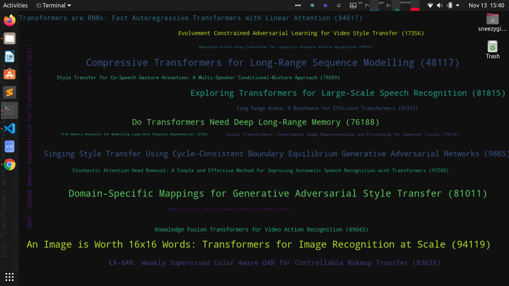

# OH-MY-DL

Simple set of python scripts to modify your desktop background to a textcloud of deep learning papers based on trending research or user specified query.



**Update**

*This branch of the repository focuses on minimal, easy access and does not include the recommendation feature. While its quite fancy and useful to have such a feature, it quite computationally expensive to build embeddings, store them, etc and contradicts the "easy access to deep learning papers" idea. Incase anyone is interested you can checkout this [branch](https://github.com/MukundVarmaT/oh-my-dl/tree/with-reco).*

## Installation

```bash
# clone repository
git clone https://github.com/MukundVarmaT/oh-my-dl.git
cd oh-my-dl/

# install dependencies
pip3 install -r requirements.txt

# first run (downloads database containing papers from 2018)
python3 ohmydl.py -u
```
## Usage

Fetch recent papers from [arxiv](https://arxiv.org) (categories: categories: cs.CV, cs.AI, cs.LG, cs.CL, cs.NE, stat.ML) and update local database

```bash
python3 ohmydl.py [-u/--update]

# in the first run, a base dataset is downloaded containing papers from 2018 and stored locally!
```

Fetch latest trending papers (based on number of GitHub stars per hour)

```bash
python3 ohmydl.py [-t/--trending]
```

Fetch recent papers (last updated from arxiv)

```bash
python3 ohmydl.py [-t/--trending]
```

Query local database for specific types of papers and update background with top results. Each paper is indexed with a number for retrieving info and direct download.

```bash
python3 ohmydl.py [-q/--query] "<query>"

# In the case of multiple queries, seperate each by a semicolon. For example: 
python3 ohmydl.py -q "transformers for image recognition; transformers for long range sequence modelling;"
```

Retrieve paper info by index (info: authors, journal, urls, abstract)

```bash
python3 ohmydl.py [-i/--info] <index>
```

Download paper by index to `<path-to-cloned-repo>/pdfs/`

```bash
python3 ohmydl.py [-d/--download] <index>
```

## Setting up alias

- Add `alias ohmydl="python3 <path to cloned folder>/ohmydl.py $@" ` to your `.bashrc` or `.zshrc`. 
- After adding the alias, all commands which looked like `python3 ohmydl.py blah..blah..` will now become `ohmydl blah..blah..` and can be run from any directory. 

## Auto update using Crontab

- Schedule new job by entering `crontab -e` and add `<frequency> /usr/bin/python3 <path-to-cloned-repo>/ohmydl.py -u > /dev/null 2>&1`. 
- For example, to update every Monday at 1 am `0 1 * * 1 /usr/bin/python3 <path-to-cloned-repo>/ohmydl.py -u > /dev/null 2>&1`.


## Modifiable parameters

can be found [here](./ohmydl.py)

```python

# path for storing local database (default: <path-to-cloned-repo/db.pickle) 
DB_PATH = f"{os.path.dirname(os.path.realpath(__file__))}/db.pickle"

# max iterations to scrap data from arxiv
MAX_ITER = 10000

# paper categories can be modified here.  
# refer https://arxiv.org/help/api/user-manual#Subject%20Classifications for more details
DEF_QUERY = "cat:cs.CV+OR+cat:cs.AI+OR+cat:cs.LG+OR+cat:cs.CL+OR+cat:cs.NE+OR+cat:stat.ML"

# maximum number of papers to be displayed on background
MAX_FOUND = 20

# path to download pdfs (default: <path-to-cloned-repo/pdfs/) 
PDF_DOWNLOAD = f"{os.path.dirname(os.path.realpath(__file__))}/pdfs"

# background properties
# color (default: dark - #101010 light - #FFFFFF)
BACKGROUND = "#101010"
# min font size of displayed text
MIN_FONT_SIZE = 8
# border padding to ensure all text is visible
MARGIN = 30
```

**Since I am personally using this utility, I will try to keep it updated. Incase of feature requests and bugs, feel free to open a new issue.**