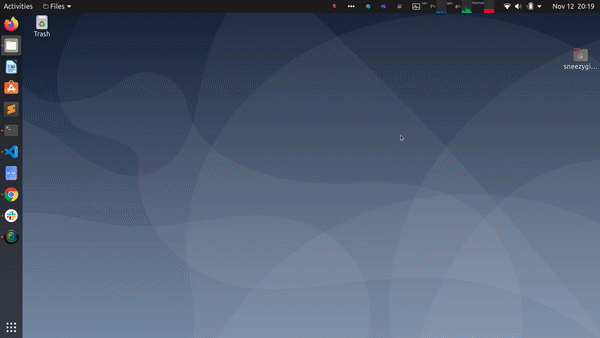
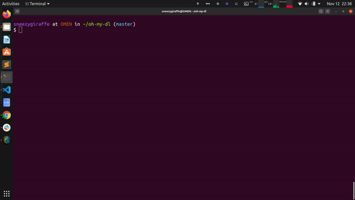

**Intial setup**

Build all necessary files and get user input for initial configuration. 

**Query Database**

Query database for papers using any text description. Updates user settings for next set of recommendations

**Update**

Update database with latest papers and modify wallpaper based on learnt interests. *Notice how my query for style transfer has changed the recommendations to include GAN based models for style transfer.*

